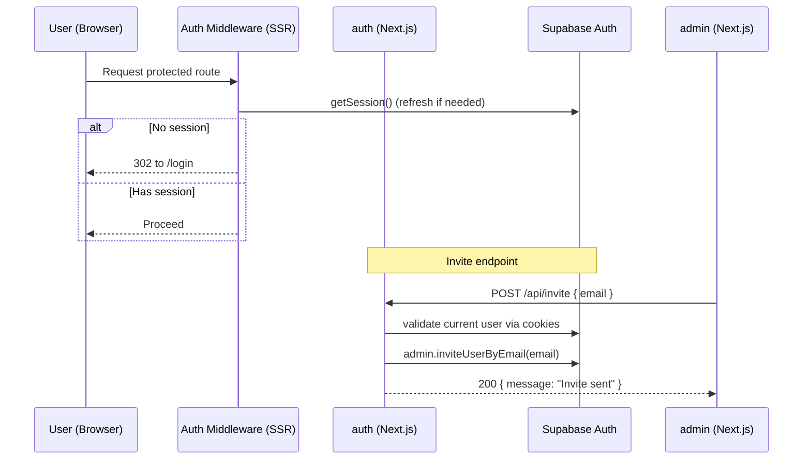
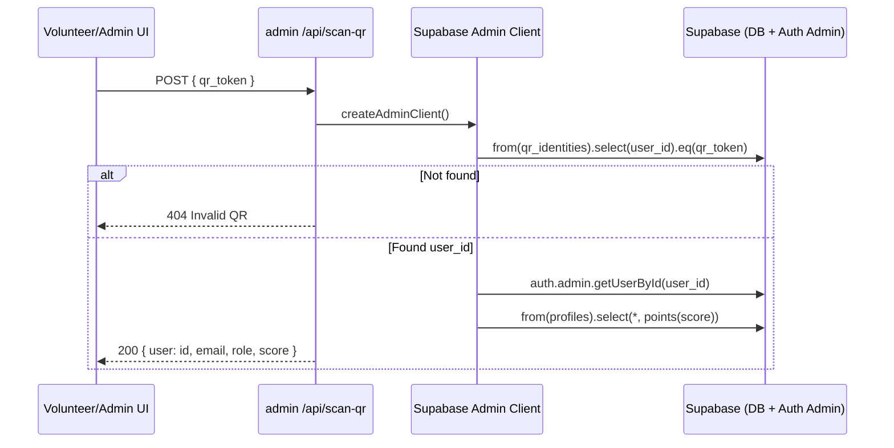
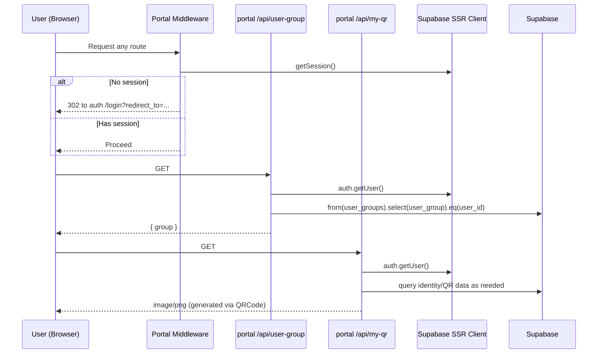
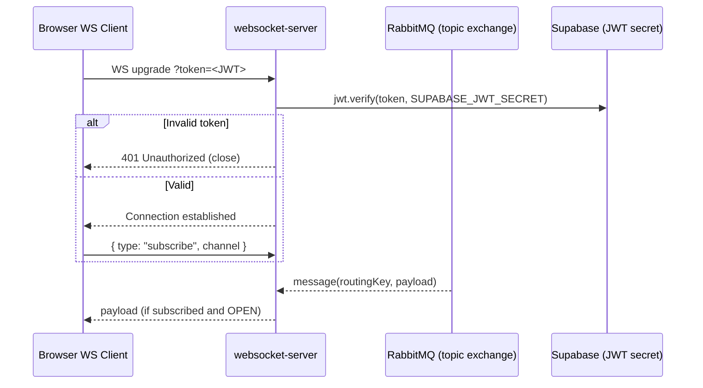
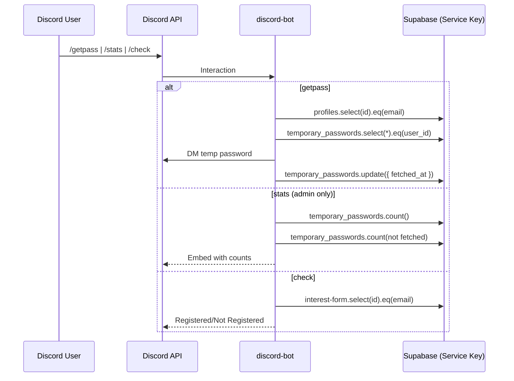

# HackUTA 2025 Monorepo Architecture

This document maps the systems, dependencies, and key request/data flows across the monorepo.

## Top-Level System
```mermaid
flowchart LR
  %% Groups
  subgraph Clients
    Browser[Users' Browsers]
    DiscordUsers[Discord Users]
  end

  subgraph "Next.js Apps"
    Frontpage[frontpage]
    Auth[auth]
    Admin[admin]
    Portal[portal]
  end

  subgraph Services
    WS[websocket-server\nNode + ws]
    DiscordBot[discord-bot\nNode + discord.js]
    RabbitMQ[(RabbitMQ\napp_events_topic)]
    Supabase[(Supabase\nAuth + Postgres + Realtime)]
  end

  subgraph Packages
    SupaPkg[@repo/supabase]
    QRPkg[@repo/qr]
  end

  %% Client -> Apps
  Browser --> Frontpage
  Browser --> Auth
  Browser --> Admin
  Browser --> Portal

  %% Shared packages used by apps
  Frontpage --> SupaPkg
  Auth --> SupaPkg
  Admin --> SupaPkg
  Portal --> SupaPkg
  Portal --> QRPkg

  %% Apps -> Supabase
  SupaPkg --> Supabase

  %% Auth redirect target
  Admin -.- "Redirect if unauthenticated" -.-> Auth
  Portal -.- "Redirect if unauthenticated" -.-> Auth

  %% Admin <-> Auth API
  Admin -- "HTTP POST /api/invite" --> Auth

  %% Realtime pipeline
  RabbitMQ -- "topic messages" --> WS
  WS == "broadcast to subscribed clients" ==> Browser
  WS -. "JWT verify with\nSUPABASE_JWT_SECRET" .-> Supabase

  %% Discord bot flows
  DiscordUsers -- "Slash Commands" --> DiscordBot
  DiscordBot --> Supabase
  DiscordBot -- "DM / Replies" --> DiscordUsers
```

## Workspace Dependency Graph
```mermaid
flowchart TD
  subgraph Apps
    A[apps/frontpage]
    B[apps/auth]
    C[apps/admin]
    D[apps/portal]
    E[apps/websocket-server]
    F[apps/discord-bot]
  end

  subgraph Packages
    P1[@repo/supabase]
    P2[@repo/qr]
    P3[@repo/tailwind-config]
    P4[@repo/eslint-config]
    P5[@repo/typescript-config]
  end

  A --> P1
  B --> P1
  C --> P1
  D --> P1
  D --> P2

  %% Dev-time configs (common but optional to visualize)
  A -.-> P3
  B -.-> P3
  C -.-> P3
  D -.-> P3
  A -.-> P4
  B -.-> P4
  C -.-> P4
  D -.-> P4
  A -.-> P5
  B -.-> P5
  C -.-> P5
  D -.-> P5
```

## Intra-App Flows

### Auth: Login + Invite


### Admin: QR Scan -> User Lookup


### Portal: User Group + My QR


### WebSocket Realtime: Auth + Subscriptions


### Discord Bot: Commands


## Notable Environment Variables
- NEXT_PUBLIC_AUTH_APP_URL: Used by admin and portal middleware to redirect to centralized auth app; also in UI links.
- NEXT_PUBLIC_SUPABASE_URL / NEXT_PUBLIC_SUPABASE_ANON_KEY: Used by @repo/supabase browser/server clients.
- SUPABASE_SERVICE_ROLE_KEY: Used by discord-bot; admin package’s server actions use admin client where needed.
- SUPABASE_JWT_SECRET: Used by websocket-server to verify JWTs on upgrade.
- RABBITMQ_URL: Used by websocket-server to connect and consume topics.

## Notes
- The websocket-server subscribes to all topics (`#`) on `app_events_topic`; clients authorize channel subscriptions per-user (`user.<uuid>`) or `public.*` as implemented.
- The `@repo/qr` package is declared and consumed by `portal`, intended for QR generation helpers. Some QR generation in admin uses `qrcode` directly.
- All Next.js apps share Supabase SSR helpers provided by `@repo/supabase` for consistent auth/session behavior.
